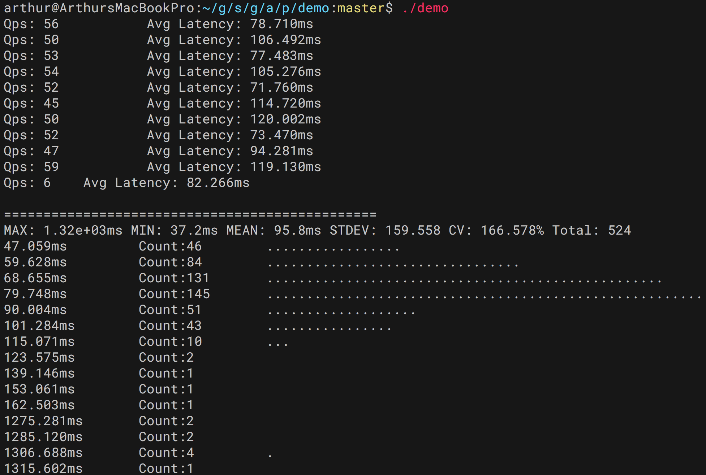

# perfm [](https://travis-ci.org/arthurkiller/perfm) [](https://goreportcard.com/report/github.com/arthurkiller/perfm)
a golang performence testing platform

## what's new
* v1.0 is comming out
* reconstruct the project for easy use
* remove the divided operation for bench and caculate

## demo client
```go
type job struct {
	// job private data
	url string
}

// Copy will called in parallel
func (j *job) Copy() (perfm.Job,error) {
	jc := *j
	return &jc, nil
}

func (j *job) Pre() error {
	// do pre job
    return nil
}
func (j *job) Do() error {
	// do benchmark job
	_, err := http.Get(j.url)
	return err
}
func (j *job) After() {
	// do clean job
}

// start perfm

perfm := perfm.New(perfm.WithBinsNumber(15), perfm.WithParallel(5), perfm.WithDuration(10))
j := &job{}
j.url = "http://www.baidu.com"
perfm.Regist(j)

perfm.Start()
perfm.Wait()

```


## Milestone
* version 0.1 
    support the qps and average cost counting
* version 1.0
    change the perfm into a testing interface, just rejuest and start, the test will be automaticly done
